# Fenote Raey Academy — final decision meeting

Presented by **MaJo Bridge Technologies and Events**

Directors · Student affairs · Quality assurance · Teachers · Administration · Parents · Drivers

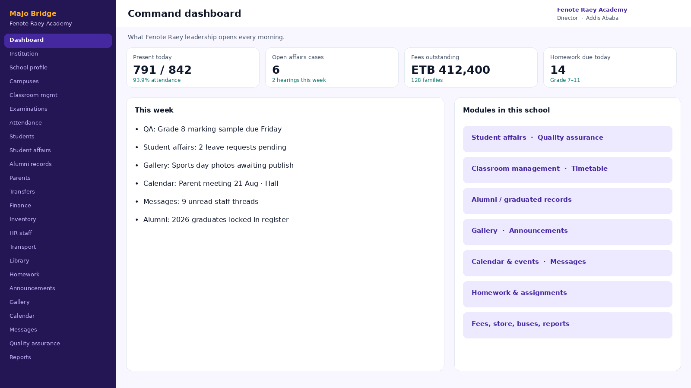

One school system. Every role in this room.

Student affairs, quality assurance, inventory, payroll (Ethiopian tax), classroom, alumni — plus the teacher, parent, student, and transport dashboards, settings, language, and school-held backups.

የፍኖተ ራእይ አካዳሚ · እያንዳንዱ ሚና የሚጠቀመው ሞጁል ዛሬ ይታያል።

---

## 1. The problem

Excel, paper, and WhatsApp are not a school system.

| Directors | Administration | Parents |
|-----------|----------------|---------|
| You hear problems late. There is no single dashboard for attendance, fees, discipline, and quality. | Rosters, fees, staff, store, and buses live in different files. One error becomes many arguments. | They wait for a call, a meeting, or a rumor. Grades appear before leadership has approved them. |

**The line:** most tools help the registrar type faster. This one helps Fenote Raey sleep — because one record is true for everyone.

---

## 2. Who uses it

Every role in this meeting has a home.

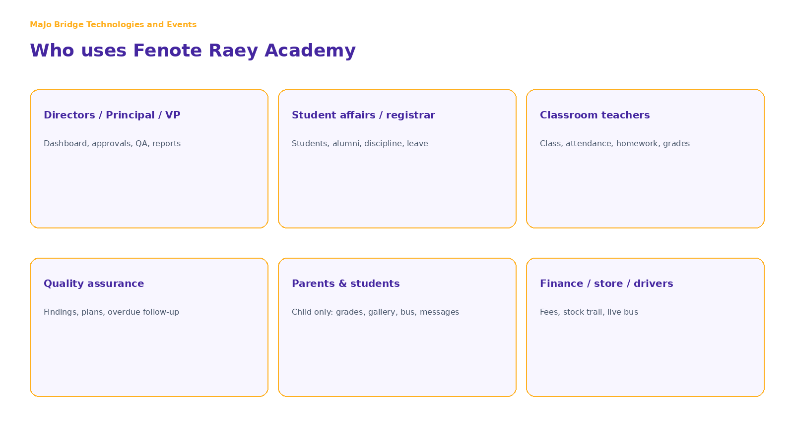

Same School ID. Different doors. Nobody sees another school. Staff only see the modules their duty requires.

- **Directors / Principal / VP** — dashboard, approvals, QA, reports
- **Student affairs / registrar** — students, alumni, discipline, leave
- **Classroom teachers** — class, attendance, homework, grades
- **Quality assurance** — findings, plans, follow-up
- **Parents** — parent dashboard: child only — grades, homework, gallery, messages, bus
- **Students** — student dashboard: profile, homework, timetable, approved grades
- **Drivers** — transport dashboard: route, passengers, QR, live map
- **Finance / store** — fees and stock trail in the office ERP

---

## 3. Every dashboard

Four homes. One school ID. Not only the office ERP.

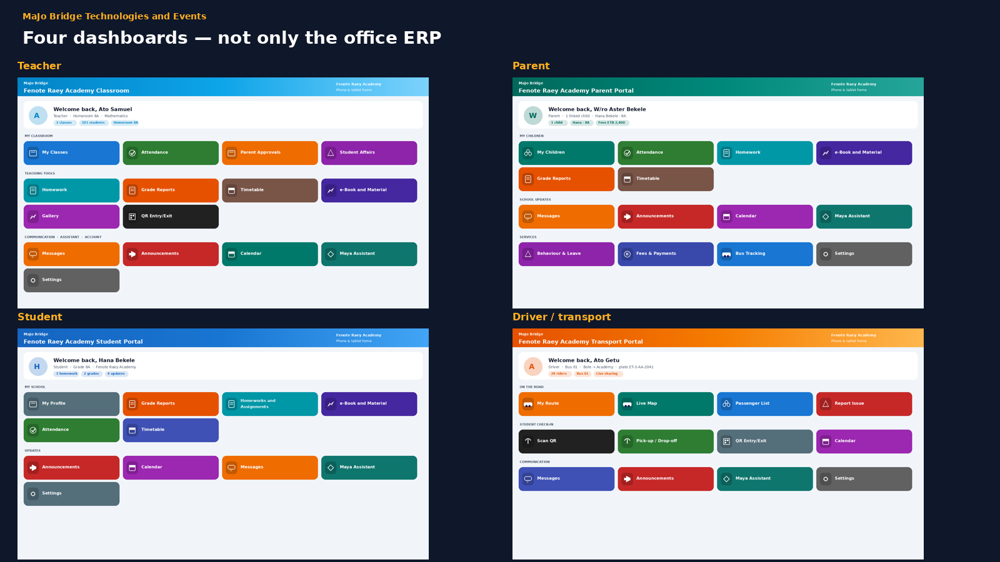

Each login opens a different home screen with that role’s modules. Same School ID. Not one shared office menu.

---

## 4. Access

One login. School ID + phone or email.

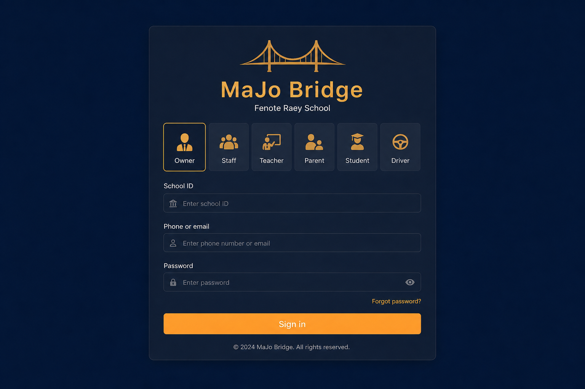

Web for the office. Phone for teachers, parents, and drivers. First login forces a new password. Temporary passwords are shown once — then destroyed.

- Languages in the product: English, Amharic, Afaan Oromo
- Forgot password by school ID + email (password is never sent in the message)
- Live web: https://mayabela.pages.dev

የትምህርት ቤት መታወቂያ + ስልክ ወይም ኢሜይል። የመጀመሪያ መግቢያ ላይ የይለፍ ቃል ይቀየራል።

---

## 5. Student login

Students log in from the grade the school sets — not a fixed Grade 7.

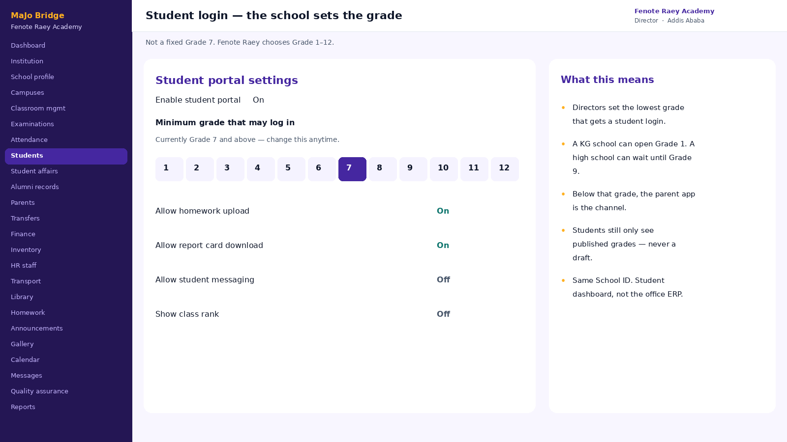

Fenote Raey chooses the lowest grade that gets a student app (Grade 1–12). Change it when the school is ready.

- Below that grade, the **parent app** is the channel
- Students still see **published grades only**
- Homework upload, report download, messaging, class rank are separate switches
- Same School ID. Student dashboard — not the office ERP

ተማሪ የሚገባው ትምህርት ቤቱ ከሚወስነው ክፍል ጀምሮ ነው።

---

## 6. For school directors

Command of the school in one screen.

This is what leadership opens every morning:

- Who is present / absent today
- Open student-affairs cases and homework due
- Outstanding fees, live buses, QA follow-ups
- Gallery, calendar, and unread messages
- Reports you can export (Excel, CSV, PDF)

The sidebar is the school: student affairs, alumni, classroom, QA, announcements, calendar, messages — not three leftover tiles.

---

## 7. For administration — registrar

Students are a register, not a chat list.

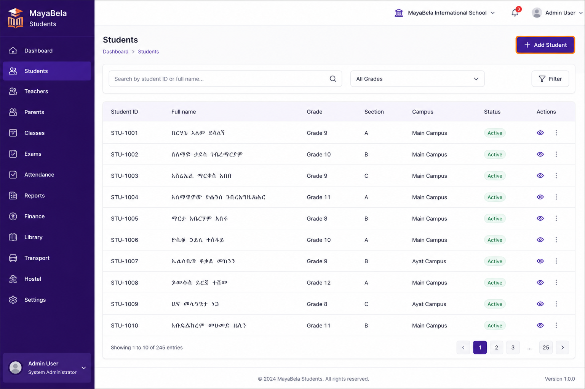

- Enroll with a short student ID (STU-####)
- Date of birth is required so parents can link safely
- Transfers and promotion are a workflow, not a deleted row
- Parent requests wait for registrar / section director approval

Wrong DOB → no link. Approved link → parent sees only their child.

---

## 8. For student affairs

Discipline and leave are a desk, not a rumour.

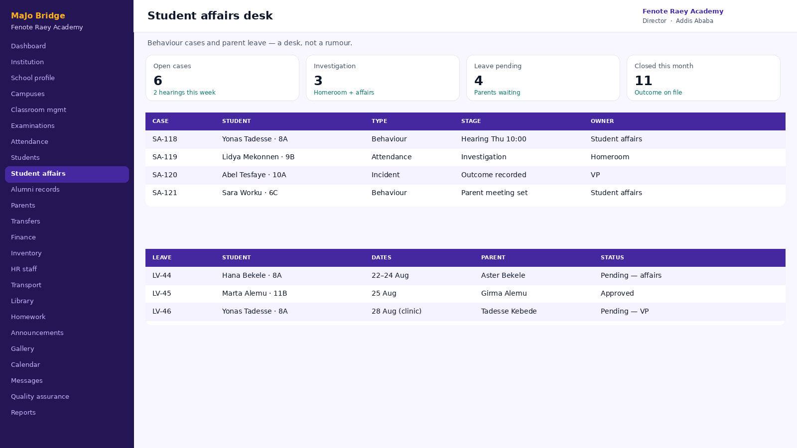

- Behaviour and incident cases: investigation → hearing → outcome
- Each case has an owner (homeroom, student affairs, VP)
- Parent leave requests wait for school approval — not a phone call that vanishes
- Teachers and parents see only what their duty allows
- Open cases show on the director dashboard the same morning

የተማሪ ጉዳይና የዲሲፕሊን መዝገብ በስርዓት ይቀመጣል።

---

## 9. Student affairs — the pipeline

A case file has a beginning, a hearing, and a written end.

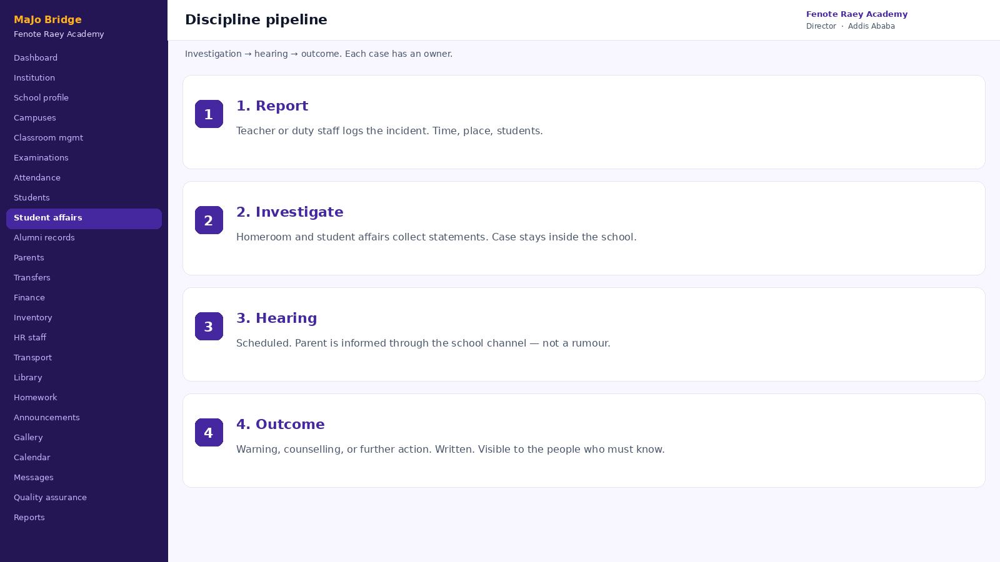

- **Report** — teacher or duty staff logs time, place, students
- **Investigate** — statements stay inside the school
- **Hearing** — parent is informed through the school channel
- **Outcome** — warning, counselling, or further action, on file

This is why student affairs is in the room today. Gossip is not a record.

---

## 10. Alumni records

Graduates stay in the school book.

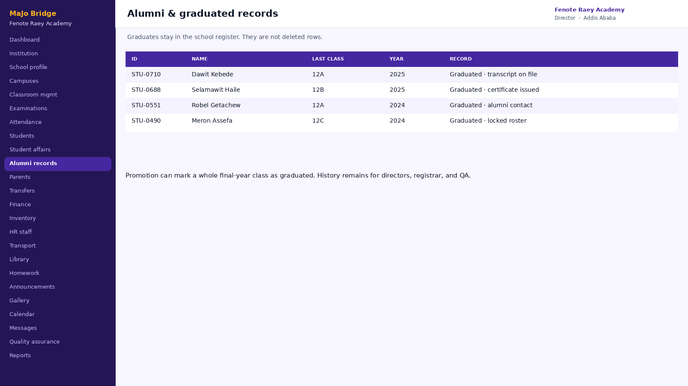

- Final-year promotion can mark a class as graduated
- Transcript / certificate history is not a deleted Excel row
- Directors, registrar, and QA can still open the record
- Alumni are not mixed back into today’s attendance list

---

## 11. Trust — the sentence to remember

**Teacher enters. Leadership approves. Then the parent sees.**

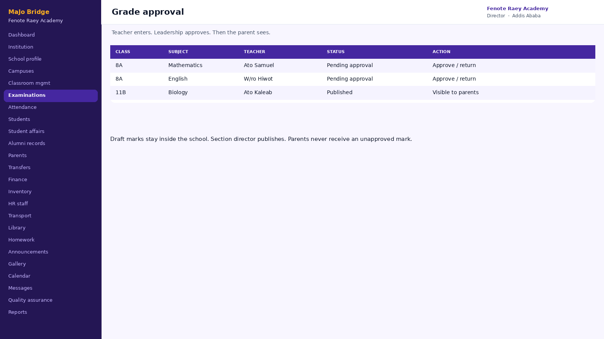

This is the difference between a portal and a school.

- Draft grades stay inside the school
- Section Director / designated approvers publish
- Parents never receive an unapproved mark
- Attendance is saved by the teacher and visible in admin reports the same day

መምህር ያስገባል → አመራር ያጸድቃል → ከዚያ ወላጅ ያያል።

---

## 12. For classroom teachers

This is the teacher dashboard — every classroom module on one home.

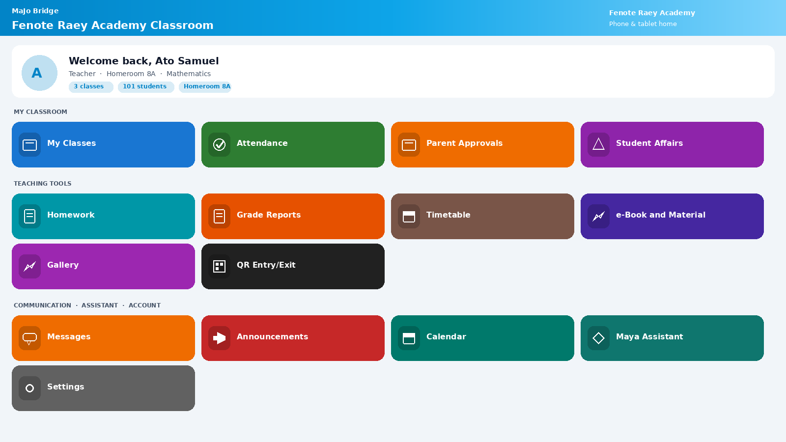

- **My classroom:** My Classes, Attendance, Parent Approvals, Student Affairs
- **Teaching tools:** Homework, Grade Reports, Timetable, e-Book, Gallery, QR
- **Communication:** Messages, Announcements, Calendar, Maya Assistant
- Teachers do not get finance, payroll, or another campus’s children

የመምህር ዳሽቦርድ — ክፍሉ የሚያስፈልገው ሁሉ እዚህ ነው።

---

## 13. Classroom management

Who teaches which class is not a hallway rumor.

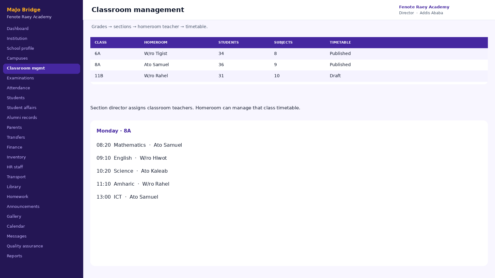

- Grades → sections → homeroom teacher → timetable
- Directors see the roster of classroom teachers in one list
- Academic year is visible so last year’s assignment is not mixed in
- Teachers then only see the classes they actually own

የክፍል መምህር ማደራጀት በስርዓት ይታያል።

---

## 14. Homework and assignments

Post the work. Parents see it. Teachers mark it done.

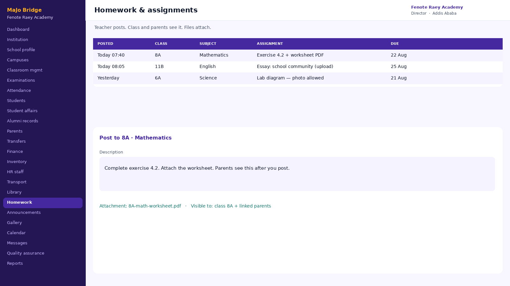

- Teacher posts title, due date, class, and file
- Parent portal shows the same homework for their child
- Status: assigned → submitted / completed
- No “please WhatsApp the worksheet” for the whole class

የቤት ሥራ በመተግበሪያ ይለጠፋል። ወላጅ ያያል።

---

## 15. For students

This is the student dashboard — their school, not the office.

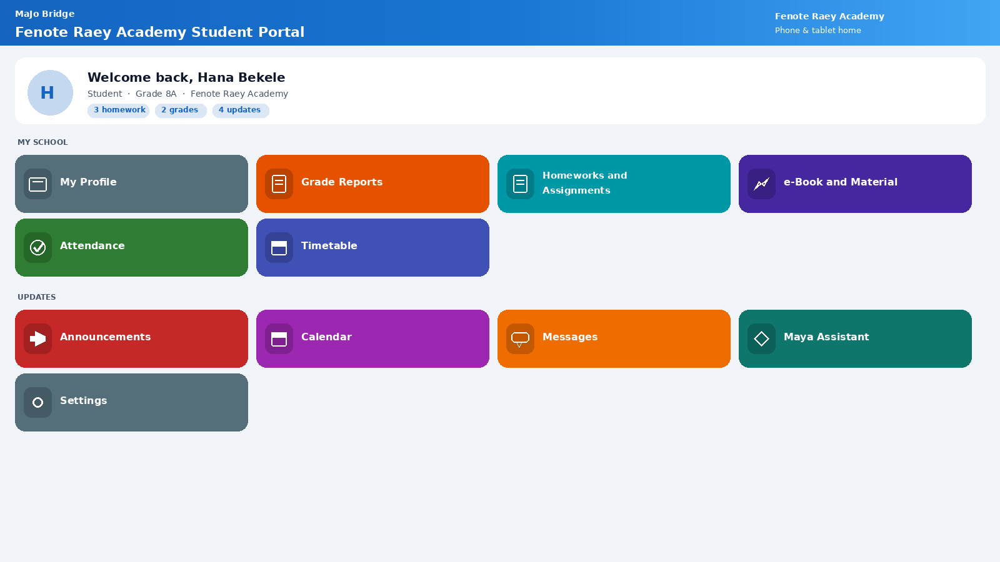

- **My school:** Profile, Grade Reports, Homeworks and Assignments, e-Book, Attendance, Timetable
- **Updates:** Announcements, Calendar, Messages, Maya Assistant
- They see published grades only — never a draft mark
- Same homework the teacher posted. Same calendar the school published

የተማሪ ዳሽቦርድ — የራሱ ትምህርት ቤት፣ የቢሮው መዝገብ አይደለም።

---

## 16. For parent representatives

This is the parent dashboard — the child, not the school’s internal politics.

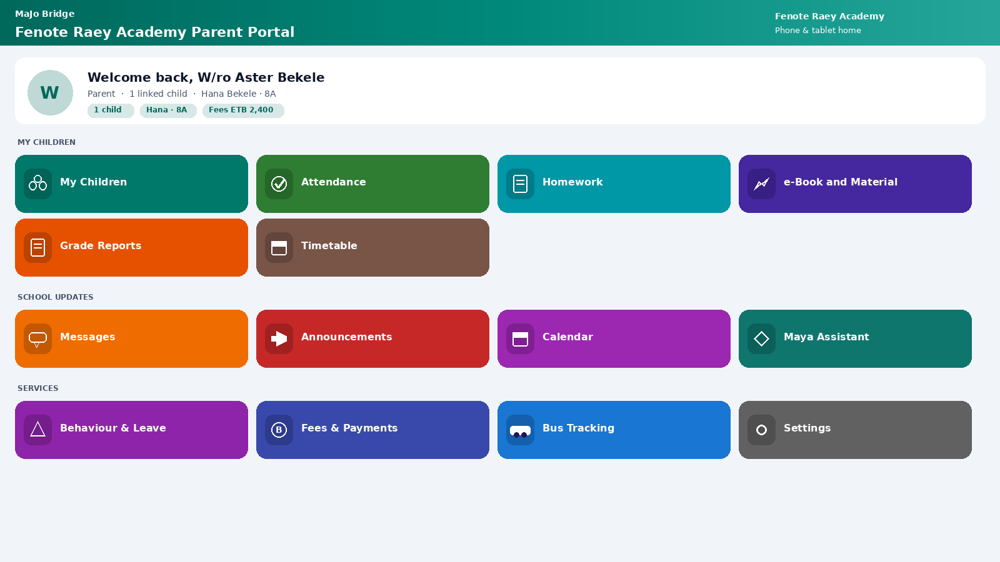

- **My children:** linked child, Attendance, Homework, e-Book, Grade Reports, Timetable
- **School updates:** Messages, Announcements, Calendar
- **Services:** Behaviour & Leave, Fees & Payments, Bus Tracking
- Link with Student ID + date of birth, then the school approves

ወላጅ የሚያየው ልጁን ብቻ ነው። ያልጸደቀ ውጤት አይታይም።

---

## 17. Transport — driver dashboard

This is the transport dashboard — every module the driver uses on the road.

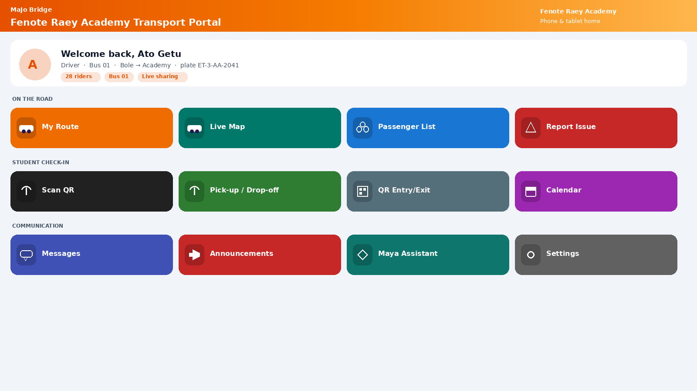

- **On the road:** My Route, Live Map, Passenger List, Report Issue
- **Student check-in:** Scan QR, Pick-up / Drop-off, QR Entry/Exit
- **Communication:** Messages, Announcements, Calendar
- Parents see “live” only while this driver is sharing location

የሹፌር ዳሽቦርድ — መስመር፣ ተሳፋሪ፣ QR እና ቀጥታ ካርታ።

---

## 18. Transport — office ERP

The bus is part of the school, not a private WhatsApp.

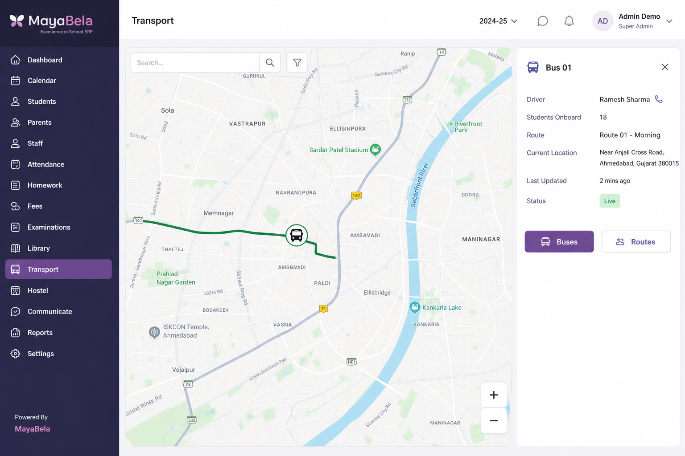

- HR / transport admin: buses, drivers, routes, riders
- Driver app: route, passenger list, QR onboard / discharge, live map
- Parent sees a live position only while sharing is on and fresh
- Stale location is not shown as “live”

This is the module parent representatives usually ask about first. It is built in — not a separate tracking company.

---

## 19. Finance

Collections you can defend in a board meeting.

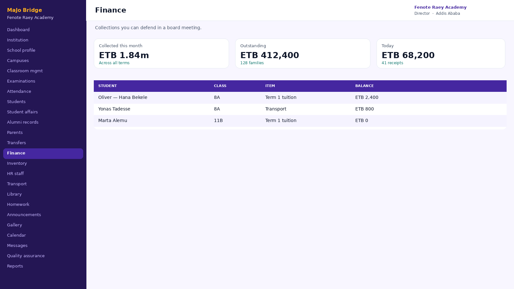

- Fee structures and payments in ETB
- Outstanding vs collected, by day and month
- Parent fee view for linked children
- Reports for leadership — not a private cashier notebook

Finance staff manage. Directors oversee. Parents see their own balance.

---

## 20. HR — payroll

Ethiopian employment tax and pension, built in — for every employee.

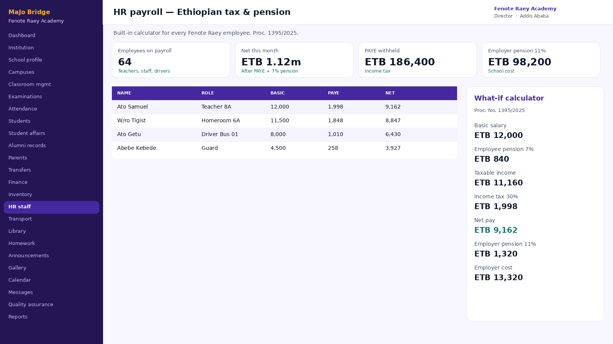

Teachers, other staff, and drivers sit on one payroll. The calculator uses **Proc. No. 1395/2025** monthly PAYE plus private-sector pension.

- Employee pension **7%** of basic salary (withheld before income tax)
- Employer pension **11%** of basic salary
- Income tax bands 0% → 35% with the legal quick deductions
- Net pay, PAYE withheld, and employer cost in ETB
- What-if calculator: type a salary and see the slip before you save

Rates can change. HR should confirm against current law. Teachers do not see another person’s pay.

---

## 21. Store and inventory

The store is a command desk: items, PRs, issues, assets, suppliers.

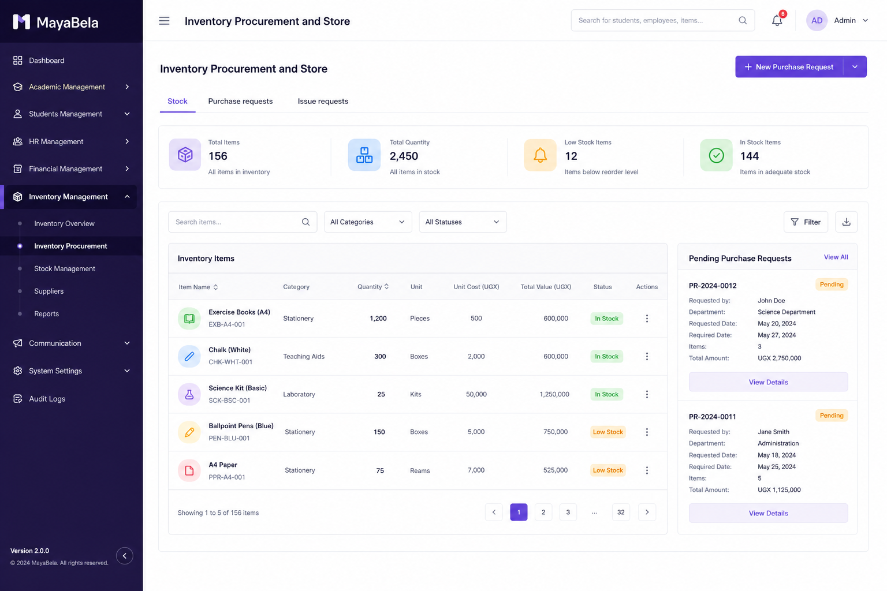

- Dashboard: stock value, open purchase requests, issue requests, assets in repair
- Purchase requests → director / procurement → receive
- Issue requests from a class or office → store keeper
- Items, stock in/out, student issued, classroom, assets, suppliers, maintenance, reports

This is where leakage usually hides in a paper school. MaJo Bridge makes it a workflow.

---

## 22. Inventory — stock trail

Every textbook and marker has a quantity and a movement.

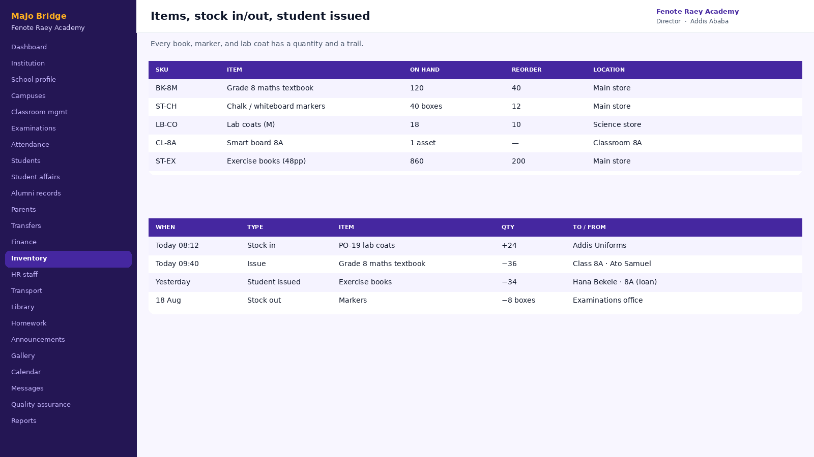

- On-hand vs reorder level, by store location
- Stock in from a supplier / PO
- Stock out to an office
- Student issued (loaned books) against a name and class

---

## 23. Inventory — purchase and issue

Ask. Approve. Receive or issue. Same numbers for three desks.

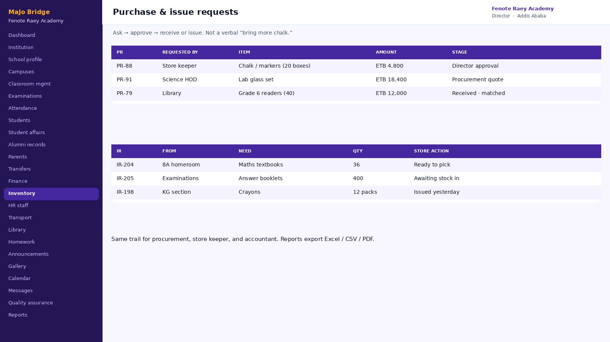

- Procurement, store keeper, and accountant share one trail
- No verbal “bring more chalk” without a request
- Reports export Excel / CSV / PDF

---

## 24. School life — announcements, gallery, calendar, messages

The school speaks in one place. Not four WhatsApp groups.

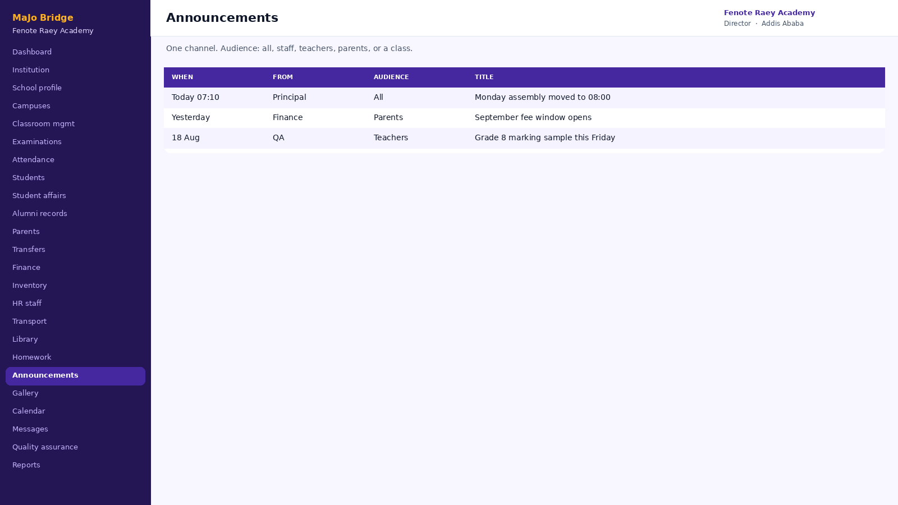

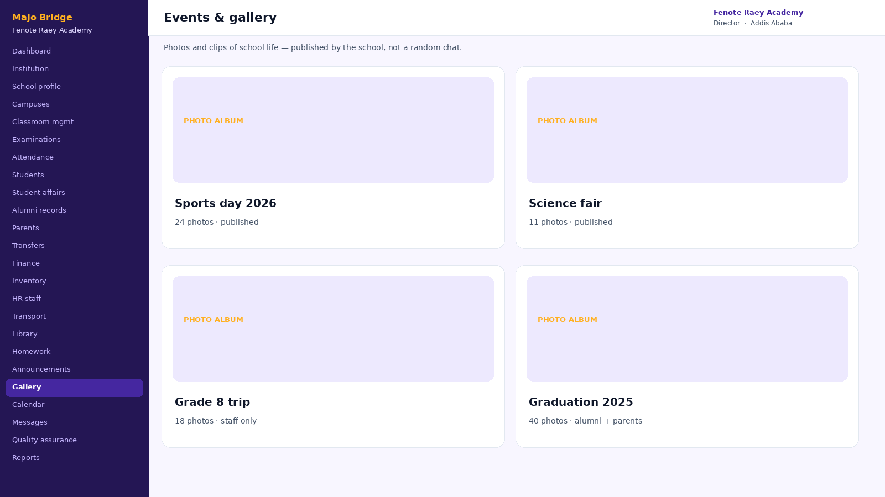

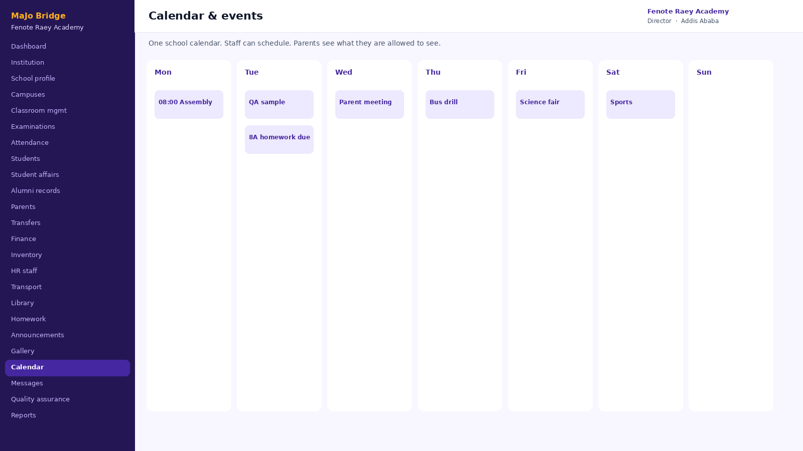

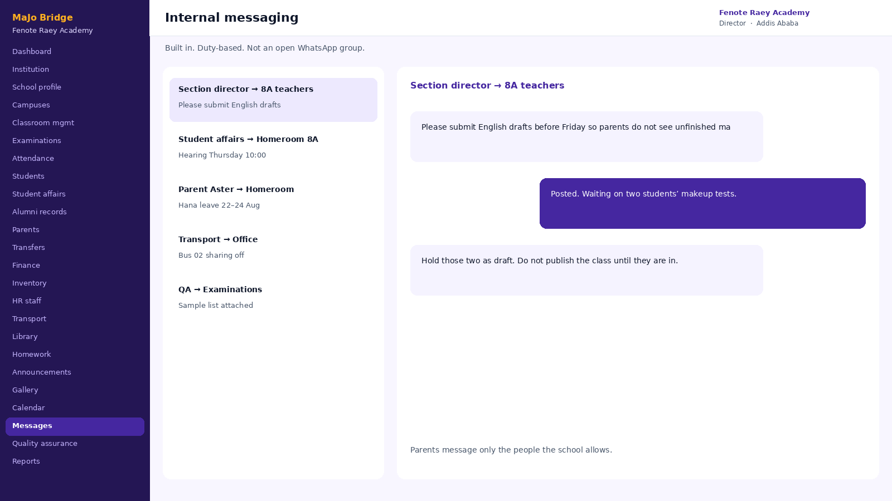

- **Announcements** — directors post; staff and parents see by role
- **Gallery** — school photos and events, not lost on a phone
- **Calendar** — exams, holidays, meetings, sports day
- **Internal messages** — teacher ↔ parent / staff, logged in the school

ማስታወቂያ፣ ጋለሪ፣ የቀን መቁጠሪያ እና መልእክት በአንድ ቦታ።

---

## 25. Quality assurance

Findings and improvement plans live next to the school, not in a drawer.

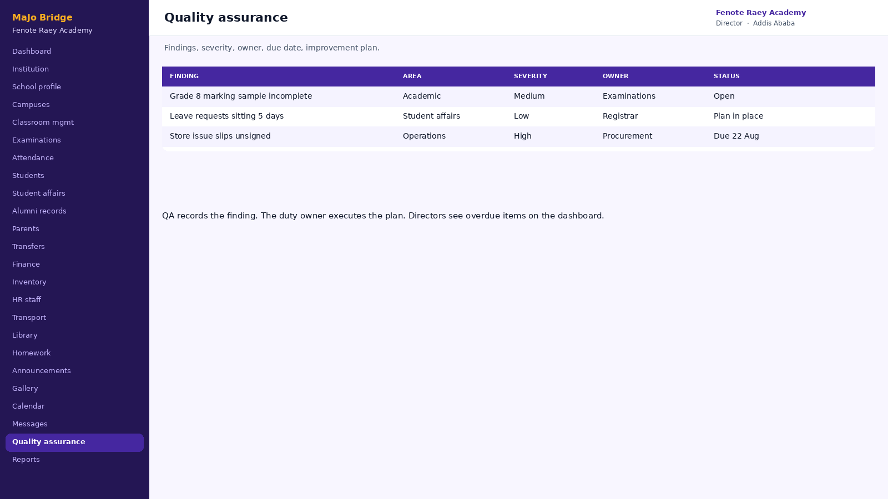

- Log a finding: classroom, library, transport, finance, student affairs…
- Status: open → in progress → closed, with severity
- Improvement plans with owner, target date, and evidence
- Leadership sees overdue follow-ups on the morning dashboard
- QA records. The duty owner executes. Directors do not hunt a paper file.

የጥራት ማረጋገጫ ግኝትና የማሻሻያ እቅድ በስርዓት።

---

## 26. Quality assurance — plans

A finding is not finished until the plan has evidence.

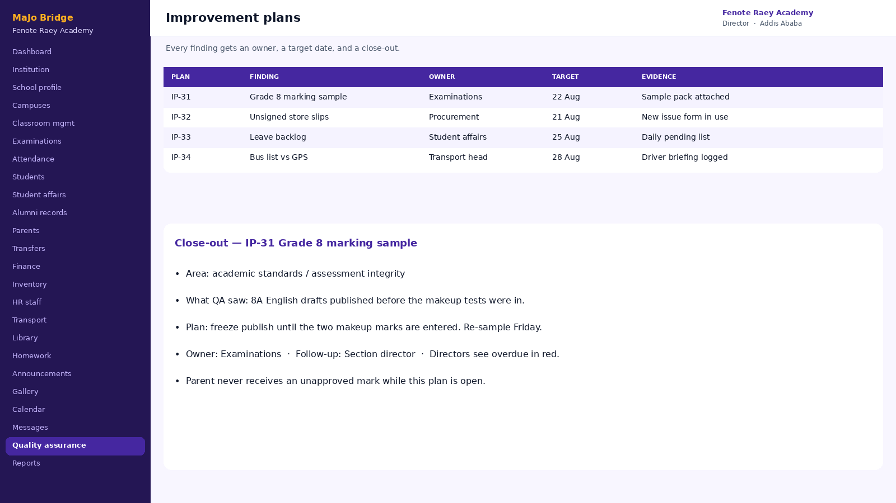

- Example: freeze grade publish until makeup marks are in
- Owner: Examinations. Follow-up: Section director
- Parents never receive an unapproved mark while that plan is open
- Transport, store, and student-affairs findings use the same book

---

## 27. Settings and language

Each person chooses English, Amharic, or Afaan Oromo.

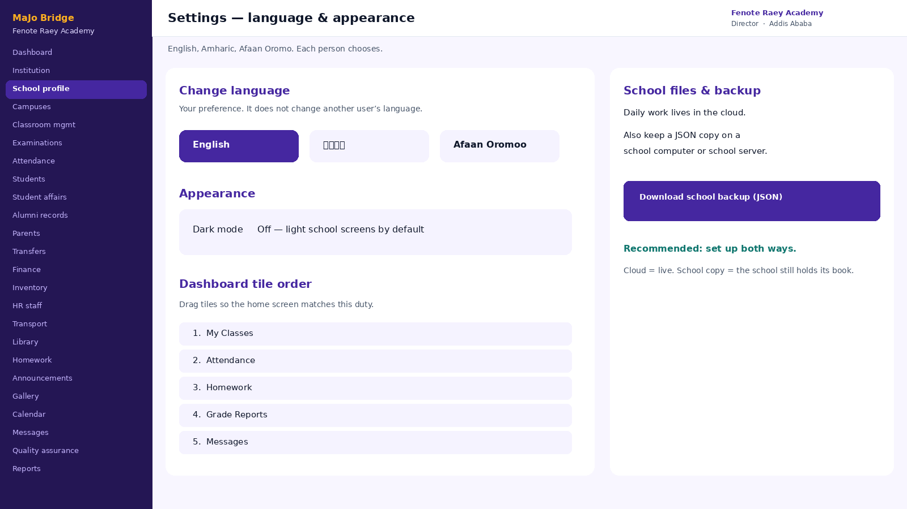

- Language preference is personal — it does not force the whole school
- Dark mode and dashboard tile order (drag to match this duty)
- From Settings, directors can also download a **school JSON backup**

ቋንቋ፣ መልክ እና የመጠባበቂያ ቅጂ ከቅንብር ይከፈታል።

---

## 28. Where files live

Cloud for daily work. School-held copy so you are not locked in.

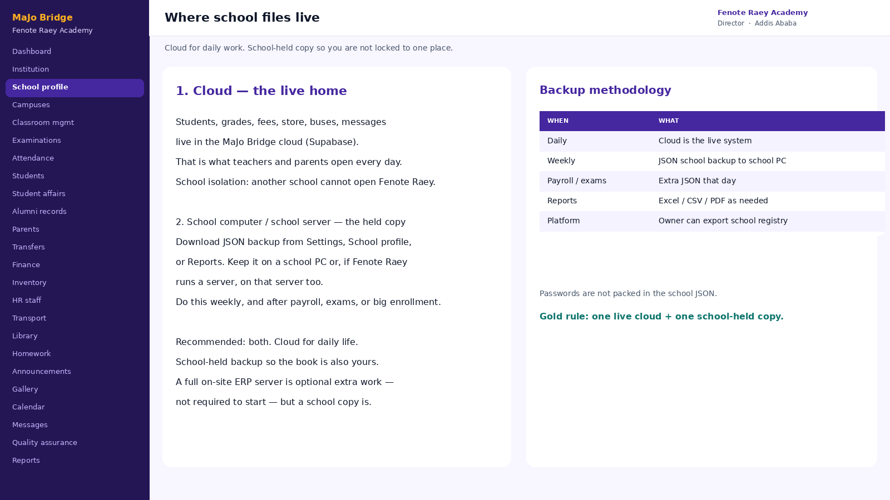

**Recommended: set up both ways.**

- **Cloud** — live students, grades, fees, store, buses, messages (MaJo Bridge / Supabase)
- **School computer or school server** — weekly JSON backup from Settings, School profile, or Reports
- Extra snapshot after payroll, exams, or a large enrollment
- A full on-site ERP server is optional extra work. A school-held copy is not optional.

Passwords are not packed in the school JSON. Platform owners can also export the school registry.

---

## 29. Full catalog — 40+ modules

What the school is buying — module by module

| Area | Modules | Who it serves |
|------|---------|---------------|
| Organization | Institution, school profile, campuses | Owners, directors |
| Student services | Students, parent-link, transfers, student affairs, alumni, student login from the grade the school sets | Registrar, student affairs |
| Classroom | Classes, classroom teachers, timetable, attendance, exams, homework and assignments | Principal, VP, teachers |
| Communication | Announcements, events and gallery, school calendar, internal messages | Every duty that must speak |
| Quality | QA findings, improvement plans, reports, Maya Assistant | QA, directors |
| Staff modules | HR, payroll (Ethiopian PAYE + pension), leave, staff documents, library, canteen, clinic | HR, librarian, nurse, canteen |
| Finance and store | Fees, invoices, receipts, expenses, inventory / procurement / assets | Accountant, store, procurement |
| Transport | Routes, GPS, boarding | Transport admin, drivers, parents |
| System | Users and roles, settings and language, audit log, branding, cloud + school-held backups | Owner / platform |

---

## 30. How a week looks

Not a theory. A working week.

| Day | What happens |
|-----|----------------|
| 1 | Office logs in. Rosters, classroom teachers, and staff passwords work. |
| 2 | Teachers take attendance, post homework, and enter subject grades. |
| 3 | Section director approves grades. Student affairs logs any case. QA opens a finding if needed. |
| 4 | Parents link children (ID + DOB). They see homework, gallery, calendar, and messages for that child. |
| 5 | Leadership prints a PDF. Store / HR payroll / transport smoke-test if you use them. Download a school JSON backup to a school PC. |

Pilot recommendation: 30–60 days, one campus or one grade band, then a board decision to expand.

---

## 31. Safety

The school’s data stays the school’s data.

| School isolation | Duty-based access | Cloud + school copy |
|------------------|-------------------|---------------------|
| Another school cannot open Fenote Raey students, fees, or messages. | A librarian does not get finance. A teacher does not get the whole payroll. VP can oversee without silently editing everything. | Live files in the cloud. Weekly JSON on a school computer or school server. Recommended: both. |

This is a school operating system from MaJo Bridge Technologies and Events. It is not a government product. It helps Fenote Raey run digitally, with a record the school can stand on.

---

## 32. The ask

**Recommend this system for Fenote Raey Academy.**

| Directors / QA | Student affairs / admin | Teachers / parents |
|----------------|-------------------------|--------------------|
| Endorse the dashboard, grade-approval rule, and quality findings. | Endorse students, alumni, discipline, fees, inventory, HR payroll, backups, and transport as the daily books. | Endorse classroom tools, homework posting, child-only access, gallery, calendar, and messages. |

Next step after this room: 30–60 day pilot on one campus/grade, support Mon–Sat 09:00–18:00 EAT, then expand.

---

## 33. Try it in the room

Live system — not a brochure.

**https://mayabela.pages.dev**

Hard-refresh if you saw an older page: Ctrl+Shift+R

Support: **+251 911 646 444** · nabilmaya6464@gmail.com

ሙከራው በቀጥታ ይከፈታል። ጥያቄ ካለዎ አሁን ይጠይቁ።

Print handout: [LEAVE_BEHIND.md](LEAVE_BEHIND.md)
