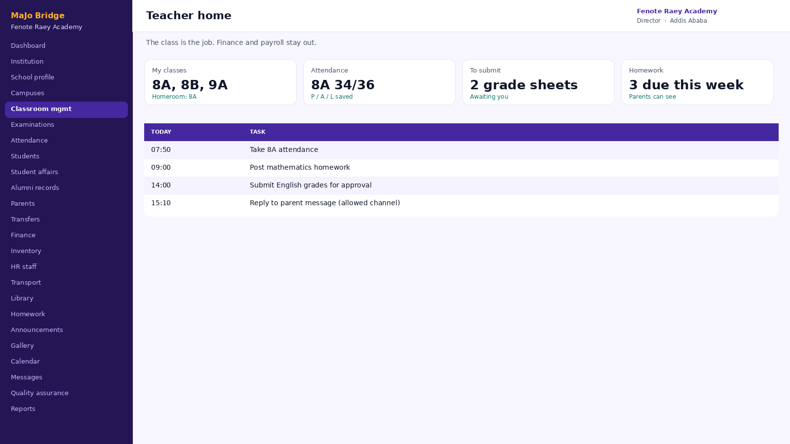
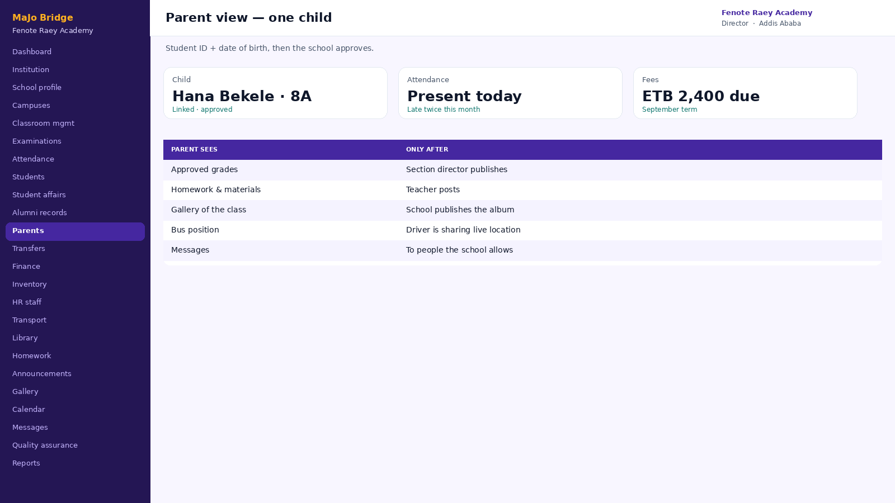

# Fenote Raey Academy — final decision meeting

Presented by **MaJo Bridge Technologies and Events**

Directors · Student affairs · Quality assurance · Teachers · Administration · Parents · Drivers

One school system. Every role in this room.

Student affairs, quality assurance, classroom management, alumni records, gallery, announcements, calendar, internal messages, homework — and the rest of the school books.

የፍኖተ ራእይ አካዳሚ · እያንዳንዱ ሚና የሚጠቀመው ሞጁል ዛሬ ይታያል።

---

## 1. Why this room

Owners directed us to proceed. This meeting is the operational yes.

Fenote Raey Academy owners have already seen this system and asked that it be executed. Today we show every body in this room **what they will use**, **what they will control**, and **how parents stay informed without gossip or delay**.

ባለቤቶቹ አቅጣጫ ሰጥተዋል። ዛሬ የዳይሬክተሮች፣ የአስተዳደር እና የወላጅ ተወካዮች ውሳኔ ነው።

**What we need from you**

- Directors: confirm this is how you want to govern the school
- Administration: confirm the daily work is covered
- Parent representatives: confirm families will be safer and better informed
- Other bodies: raise gaps now, not after go-live

---

## 2. The problem

Excel, paper, and WhatsApp are not a school system.

| Directors | Administration | Parents |
|-----------|----------------|---------|
| You hear problems late. There is no single dashboard for attendance, fees, discipline, and quality. | Rosters, fees, staff, store, and buses live in different files. One error becomes many arguments. | They wait for a call, a meeting, or a rumor. Grades appear before leadership has approved them. |

**The line:** most tools help the registrar type faster. This one helps Fenote Raey sleep — because one record is true for everyone.

---

## 3. Who uses it

Every role in this meeting has a home.

Same School ID. Different doors. Nobody sees another school. Staff only see the modules their duty requires.

- **Directors / Principal / VP** — dashboard, approvals, QA, reports
- **Student affairs / registrar** — students, alumni, discipline, leave
- **Classroom teachers** — class, attendance, homework, grades
- **Quality assurance** — findings, plans, follow-up
- **Parents & students** — child only: grades, gallery, messages, bus
- **Finance / store / drivers** — fees, stock trail, live bus

---

## 4. Access

One login. School ID + phone or email.

Web for the office. Phone for teachers, parents, and drivers. First login forces a new password. Temporary passwords are shown once — then destroyed.

- Languages in the product: English, Amharic, Afaan Oromo
- Forgot password by school ID + email (password is never sent in the message)
- Live web: https://mayabela.pages.dev

የትምህርት ቤት መታወቂያ + ስልክ ወይም ኢሜይል። የመጀመሪያ መግቢያ ላይ የይለፍ ቃል ይቀየራል።

---

## 5. For school directors

Command of the school in one screen.

This is what leadership opens every morning:

- Who is present / absent today
- Open student-affairs cases and homework due
- Outstanding fees, live buses, QA follow-ups
- Gallery, calendar, and unread messages
- Reports you can export (Excel, CSV, PDF)

The sidebar is the school: student affairs, alumni, classroom, QA, announcements, calendar, messages — not three leftover tiles.

---

## 6. For administration — registrar

Students are a register, not a chat list.

- Enroll with a short student ID (STU-####)
- Date of birth is required so parents can link safely
- Transfers and promotion are a workflow, not a deleted row
- Parent requests wait for registrar / section director approval

Wrong DOB → no link. Approved link → parent sees only their child.

---

## 7. For student affairs

Discipline and leave are a desk, not a rumour.

- Behaviour and incident cases: investigation → hearing → outcome
- Each case has an owner (homeroom, student affairs, VP)
- Parent leave requests wait for school approval
- Teachers and parents see only what their duty allows

የተማሪ ጉዳይና የዲሲፕሊን መዝገብ በስርዓት ይቀመጣል።

---

## 8. Alumni records

Graduates stay in the school book.

- Final-year promotion can mark a class as graduated
- Transcript / certificate history is not a deleted Excel row
- Directors, registrar, and QA can still open the record
- Alumni are not mixed back into today’s attendance list

---

## 9. Trust — the sentence to remember

**Teacher enters. Leadership approves. Then the parent sees.**

This is the difference between a portal and a school.

- Draft grades stay inside the school
- Section Director / designated approvers publish
- Parents never receive an unapproved mark
- Attendance is saved by the teacher and visible in admin reports the same day

መምህር ያስገባል → አመራር ያጸድቃል → ከዚያ ወላጅ ያያል።

---

## 10. For classroom teachers

The class is the job. The system stays out of the way.

- My classes, attendance (P / A / L), homework
- Enter subject grades and submit for approval
- Timetable, learning materials, announcements
- Messages within the school’s allowed channels
- Homeroom teachers can manage that class timetable

Teachers do not get the finance office, the whole staff directory, or another campus’s children.

---

## 11. Classroom management

Who teaches which class is not a hallway rumor.

- Grades → sections → homeroom teacher → timetable
- Directors see the roster of classroom teachers in one list
- Academic year is visible so last year’s assignment is not mixed in
- Teachers then only see the classes they actually own

የክፍል መምህር ማደራጀት በስርዓት ይታያል።

---

## 12. Homework and assignments

Post the work. Parents see it. Teachers mark it done.

- Teacher posts title, due date, class, and file
- Parent portal shows the same homework for their child
- Status: assigned → submitted / completed
- No “please WhatsApp the worksheet” for the whole class

የቤት ሥራ በመተግበሪያ ይለጠፋል። ወላጅ ያያል።

---

## 13. For parent representatives

The parent sees the child — not the school’s internal politics.

- Link with Student ID + date of birth, then wait for school approval
- Attendance, approved grades, homework, materials
- School gallery and announcements for their child
- Fee balance and calendar events they are allowed to see
- Bus tracking when the driver is sharing location
- Internal messages to the people the school allows

ወላጅ የሚያየው ልጁን ብቻ ነው። ያልጸደቀ ውጤት አይታይም። የባስ አካባቢ ሹፌሩ ሲያጋራ ብቻ ነው።

---

## 14. Transport

The bus is part of the school, not a private WhatsApp.

- HR / transport admin: buses, drivers, routes, riders
- Driver app: route, passenger list, QR onboard / discharge, live map
- Parent sees a live position only while sharing is on and fresh
- Stale location is not shown as “live”

This is the module parent representatives usually ask about first. It is built in — not a separate tracking company.

---

## 15. Finance

Collections you can defend in a board meeting.

- Fee structures and payments in ETB
- Outstanding vs collected, by day and month
- Parent fee view for linked children
- Reports for leadership — not a private cashier notebook

Finance staff manage. Directors oversee. Parents see their own balance.

---

## 16. Store and procurement

Books, chalk, and purchases leave a trail.

- Stock on hand
- Purchase requests → approval → receive
- Issue requests from departments → store keeper
- Procurement, store, and accountant see the same numbers

This is where leakage usually hides in a paper school. MaJo Bridge makes it a workflow.

---

## 17. School life — announcements, gallery, calendar, messages

The school speaks in one place. Not four WhatsApp groups.

- **Announcements** — directors post; staff and parents see by role
- **Gallery** — school photos and events, not lost on a phone
- **Calendar** — exams, holidays, meetings, sports day
- **Internal messages** — teacher ↔ parent / staff, logged in the school

ማስታወቂያ፣ ጋለሪ፣ የቀን መቁጠሪያ እና መልእክት በአንድ ቦታ።

---

## 18. Quality assurance

Findings and improvement plans live next to the school, not in a drawer.

- Log a finding: classroom, library, transport, finance…
- Status: open → in progress → closed
- Improvement plans with owner and target date
- Leadership and QA staff see the same book

የጥራት ማረጋገጫ ግኝትና የማሻሻያ እቅድ በስርዓት።

---

## 19. Full catalog — 40+ modules

What the school is buying — module by module

| Area | Modules | Who it serves |
|------|---------|---------------|
| Organization | Institution, school profile, campuses | Owners, directors |
| Student services | Students, parent-link, transfers, student affairs, alumni / graduated records | Registrar, student affairs |
| Classroom | Classes, classroom teachers, timetable, attendance, exams, homework and assignments | Principal, VP, teachers |
| Communication | Announcements, events and gallery, school calendar, internal messages | Every duty that must speak |
| Quality | QA findings and plans, reports, Maya Assistant | QA, directors |
| Staff modules | HR, payroll, leave, staff documents, library, canteen, clinic | HR, librarian, nurse, canteen |
| Finance and store | Fees, invoices, receipts, expenses, inventory / procurement | Accountant, store, procurement |
| Transport | Routes, GPS, boarding | Transport admin, drivers, parents |
| System | Users and roles, audit log, branding, backups | Owner / platform |

---

## 20. How a week looks

Not a theory. A working week.

| Day | What happens |
|-----|----------------|
| 1 | Office logs in. Rosters, classroom teachers, and staff passwords work. |
| 2 | Teachers take attendance, post homework, and enter subject grades. |
| 3 | Section director approves grades. Student affairs logs any case. QA opens a finding if needed. |
| 4 | Parents link children (ID + DOB). They see homework, gallery, calendar, and messages for that child. |
| 5 | Leadership prints a PDF. Store / HR / transport smoke-test if you use them. |

Pilot recommendation: 30–60 days, one campus or one grade band, then a board decision to expand.

---

## 21. Safety

The school’s data stays the school’s data.

| School isolation | Duty-based access | Audit |
|------------------|-------------------|-------|
| Another school cannot open Fenote Raey students, fees, or messages. | A librarian does not get finance. A teacher does not get the whole payroll. VP can oversee without silently editing everything. | Sensitive admin actions can be reviewed. Temporary passwords are unique and must be changed. |

This is a school operating system from MaJo Bridge Technologies and Events. It is not a government product. It helps Fenote Raey run digitally, with a record the school can stand on.

---

## 22. The ask

**Recommend this system for Fenote Raey Academy.**

| Directors / QA | Student affairs / admin | Teachers / parents |
|----------------|-------------------------|--------------------|
| Endorse the dashboard, grade-approval rule, and quality findings. | Endorse students, alumni, discipline, fees, HR, store, and transport as the daily books. | Endorse classroom tools, homework posting, child-only access, gallery, calendar, and messages. |

Next step after this room: 30–60 day pilot on one campus/grade, support Mon–Sat 09:00–18:00 EAT, then expand.

---

## 23. Try it in the room

Live system — not a brochure.

**https://mayabela.pages.dev**

Hard-refresh if you saw an older page: Ctrl+Shift+R

Support: **+251 911 646 444** · nabilmaya6464@gmail.com

ሙከራው በቀጥታ ይከፈታል። ጥያቄ ካለዎ አሁን ይጠይቁ።

Print handout: [LEAVE_BEHIND.md](LEAVE_BEHIND.md)
